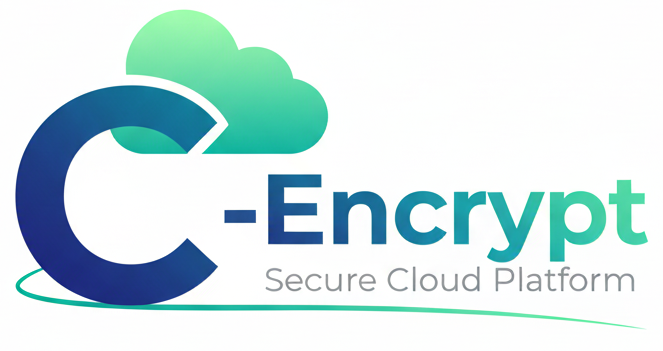

<a id="readme-top"></a>

<div align="center">


### 🔒 Secure • Offline • Multi-User • Auditable

A terminal-based encrypted file vault built with Python featuring secure authentication, file encryption, integrity verification, and administrative controls.

<br>


<br><br>

<a href="#preview">Preview</a> • <a href="#features">Features</a> • <a href="#security">Security</a> • <a href="#installation">Installation</a>

</div>

---

## 📸 Preview

<div align="center">



</div>

> Replace this image with a 10–15 second demo GIF showing Login → Encrypt → Decrypt → Admin Panel.

---

## 📖 About

C-Encrypt is a secure command-line file vault designed to demonstrate encryption, authentication, key management, and audit logging principles.

Unlike simple file encryption scripts, C-Encrypt includes:

* Multi-user authentication
* Role-based access control
* File integrity verification
* Encryption key management
* Activity logging
* Administrative controls

All while running completely offline.

---

## ✨ Features

<table>
<tr>
<td width="50%">

### 👤 User Features

* Encrypt files securely
* Decrypt files using keys
* Share encryption keys
* Verify file integrity
* Backup encryption keys
* View activity history
* Change password
* Delete account

</td>

<td width="50%">

### 🛡️ Admin Features

* Manage users
* Reset passwords
* View system logs
* Export logs
* Maintenance mode
* Remove orphaned files
* View statistics
* Delete user accounts

</td>
</tr>
</table>

---

## 🔒 Security

| Component              | Implementation      |
| ---------------------- | ------------------- |
| Password Hashing       | PBKDF2-HMAC-SHA256  |
| Iterations             | 100,000             |
| File Encryption        | Fernet AES-128      |
| Integrity Verification | SHA256              |
| Audit Logging          | Timestamped Events  |
| Key Storage            | Isolated From Files |

### Security Highlights

✅ No plaintext passwords

✅ Unique encryption key per file

✅ SHA256 integrity verification

✅ Separate key storage

✅ Full audit logging

✅ Offline operation

---

## 🛠️ Built With

<div align="center">


&nbsp;&nbsp;

&nbsp;&nbsp;


</div>

<br>

| Library      | Purpose                             |
| ------------ | ----------------------------------- |
| cryptography | Encryption & key generation         |
| hashlib      | Password hashing & integrity checks |
| colorama     | Terminal colors & formatting        |

---

## 🚀 Installation

### Clone Repository

```bash
git clone https://github.com/Superduash/C-Encrypt.git
cd C-Encrypt
```

### Install Dependencies

```bash
pip install -r requirements.txt
```

### Launch

```bash
python main.py
```

### Windows Users

Simply run:

```bash
start.bat
```

The launcher automatically:

* Checks Python installation
* Installs dependencies
* Starts the application

---

## 🎯 Usage

### Default Administrator

```text
Username : Admin
Password : admin
```

Change this password immediately after first login.

### Password Rules

* Minimum 8 characters
* At least one uppercase letter
* At least one number

---

## 📂 Project Structure

```text
C-Encrypt/
│
├── main.py
├── start.bat
├── requirements.txt
│
└── cstorage/
    ├── encrypted/
    ├── keys/
    ├── decrypted/
    ├── backups/
    ├── users.txt
    ├── logs.txt
    └── metadata.json
```

---

## 🗺️ Roadmap

* [x] Multi-user authentication
* [x] File encryption
* [x] Audit logging
* [x] Key management
* [ ] GUI version
* [ ] Linux installer
* [ ] Docker support
* [ ] MFA authentication
* [ ] Cloud backup support

---

## 🎓 What I Learned

* Applied Cryptography
* Secure Authentication Systems
* Role-Based Access Control
* File Integrity Verification
* Audit Logging
* Python Application Design

---

## 📄 License

Distributed under the MIT License.

---

<div align="center">

### ⭐ If you found this project interesting, consider starring the repository.

Built by Ashwin for the ITD2102 Python Mini Project.

</div>

<p align="center">

</p>
